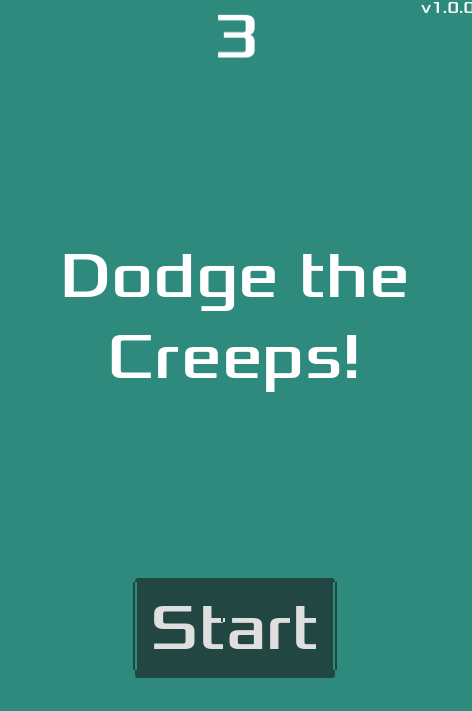

# Dodge the Creeps C#



## 项目简介

本项目是将Godot官方的"Dodge the Creeps"教程从GDScript转换为C#的实现。主要目标是展示如何在保持相同游戏功能的前提下，使用C#替代GDScript进行Godot游戏开发。

## 项目结构

```
/
├── art/                  # 游戏美术资源
├── fonts/                # 字体资源
├── docs/                 # 项目文档
├── Player.cs             # 玩家角色脚本
├── Mob.cs                # 敌人脚本
├── Main.cs               # 主游戏场景脚本
├── HUD.cs                # 用户界面脚本
└── *.tscn                # 场景文件
```

## 致谢

- Godot Engine团队提供的原始"Dodge the Creeps"教程
- 所有游戏资源来自Godot官方教程