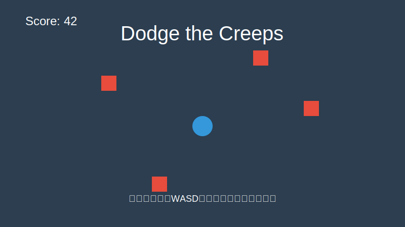

# Dodge the Creeps C#



## 项目简介

"Dodge the Creeps"是一个简单的2D游戏，玩家控制一个角色在屏幕上移动，目标是尽可能长时间地避开随机生成的敌人。本项目是使用Godot 4.x和C#实现的版本，基于官方GDScript版本的教程。

## 功能特点

- 简单直观的控制：使用方向键或WASD控制角色移动
- 随机生成的敌人：敌人从屏幕边缘随机生成，具有不同的外观和移动速度
- 计分系统：根据生存时间计算分数
- 动画效果：角色和敌人都有动画效果，增强游戏体验
- 音效：包含背景音乐和游戏结束音效

## 安装与运行

### 前提条件

- [Godot 4.x](https://godotengine.org/download) (C#版本)
- [.NET SDK 8.0](https://dotnet.microsoft.com/download) 或更高版本

### 运行步骤

1. 克隆或下载本仓库
2. 使用Godot 4.x (C#版本) 打开项目
   - 可以通过Godot编辑器界面打开
   - 或使用命令行启动：
     ```
     路径\到\Godot_v4.x-stable_mono_win64_console.exe --path "项目路径" --verbose
     ```
3. 点击"运行"按钮或按F5启动游戏

### 环境配置

本项目使用以下环境配置进行开发和测试：

- **Godot版本**: 4.4.1-stable (Mono/C#版本)
- **目标框架**: .NET 8.0
- **操作系统**: Windows

详细的环境配置信息请参考[环境信息文档](docs/environment_info.md)。

## 项目结构

```
/
├── art/                  # 游戏美术资源
├── fonts/                # 字体资源
├── docs/                 # 项目文档
│   ├── project_overview.md      # 项目概述
│   ├── csharp_conversion_guide.md # C#转换指南
│   ├── class_structure.md       # 类结构文档
│   ├── troubleshooting.md       # 故障排除指南
│   ├── environment_info.md      # 环境配置信息
│   └── images/                  # 文档图片
├── Player.cs             # 玩家角色脚本
├── Mob.cs                # 敌人脚本
├── Main.cs               # 主游戏场景脚本
├── HUD.cs                # 用户界面脚本
└── *.tscn                # 场景文件
```

## 文档

- [项目概述](docs/project_overview.md) - 游戏的基本信息和技术实现
- [C#转换指南](docs/csharp_conversion_guide.md) - 从GDScript到C#的转换经验
- [类结构文档](docs/class_structure.md) - 详细的类结构和功能说明
- [故障排除指南](docs/troubleshooting.md) - 常见问题和解决方案
- [环境信息](docs/environment_info.md) - 开发环境配置信息

## 游戏控制

- **方向键** 或 **WASD**: 移动角色
- **开始按钮**: 开始新游戏

## 开发笔记

本项目是将Godot官方的"Dodge the Creeps"教程从GDScript转换为C#的实现。主要目标是展示如何在保持相同游戏功能的前提下，使用C#替代GDScript进行Godot游戏开发。

转换过程中的主要挑战包括：

1. 适应C#的语法和命名约定
2. 处理信号（事件）连接
3. 实现异步操作
4. 配置正确的项目结构和命名空间

## 贡献

欢迎贡献代码、报告问题或提出改进建议。请遵循以下步骤：

1. Fork本仓库
2. 创建您的特性分支 (`git checkout -b feature/amazing-feature`)
3. 提交您的更改 (`git commit -m 'Add some amazing feature'`)
4. 推送到分支 (`git push origin feature/amazing-feature`)
5. 打开Pull Request

## 许可证

本项目采用MIT许可证 - 详情请参阅[LICENSE](LICENSE)文件

## 致谢

- Godot Engine团队提供的原始"Dodge the Creeps"教程
- 所有游戏资源来自Godot官方教程